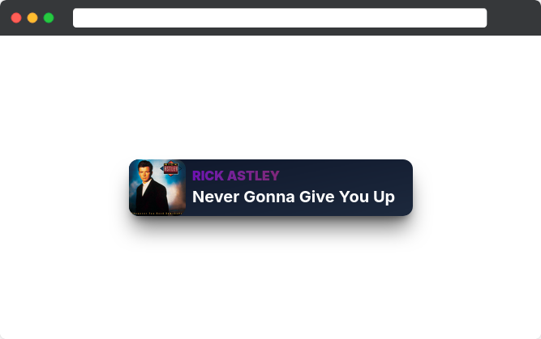

# Spotify Currently Playing

A web application that displays your currently playing Spotify track in real-time. Perfect for streamers and content creators who want to show their music in stream overlays.

## Features

- 🎵 Real-time display of currently playing Spotify track
- 🔐 Secure Spotify OAuth integration
- 📱 Responsive design suitable for stream overlays
- 🐳 Docker support for easy deployment
- ⚡ Built with modern web technologies


> *Showcasing an amazing music being played.*

## Installation & Usage

### Using Docker Compose

1. **Clone the repository**
   ```bash
   git clone https://github.com/Quozul/spotify-currently-playing.git
   cd spotify-currently-playing
   ```

2. **Set up environment variables**
   ```bash
   cp .env.example .env
   ```

   Edit the `.env` file with your Spotify credentials.

3. **Start the application**
   ```bash
   docker compose up -d
   ```

The application will be available at `http://localhost:3000`

## Spotify App Setup

1. Go to the [Spotify Developer Dashboard](https://developer.spotify.com/dashboard/)
2. Create a new app
3. Add your redirect URI:
   - For Docker: `http://localhost:3000/`
   - For local development: `http://localhost:5173/`
4. Copy your Client ID and Client Secret to your `.env` file

## Usage for Streaming

1. Open the application in your browser
2. Log in with your Spotify account
3. Add the web page as a browser source in your streaming software (OBS, Streamlabs, etc.)

## Development

### Developing

Once you've cloned the project and installed dependencies with `npm install`, start a development server:

```bash
npm run dev

# or start the server and open the app in a new browser tab
npm run dev -- --open
```

You can use the provided Docker Compose to run just the database:
   ```bash
   docker compose up db -d
   ```

### Building

To create a production version of the app:

```bash
npm run build
```

You can preview the production build with `npm run preview`.
